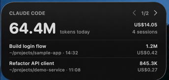
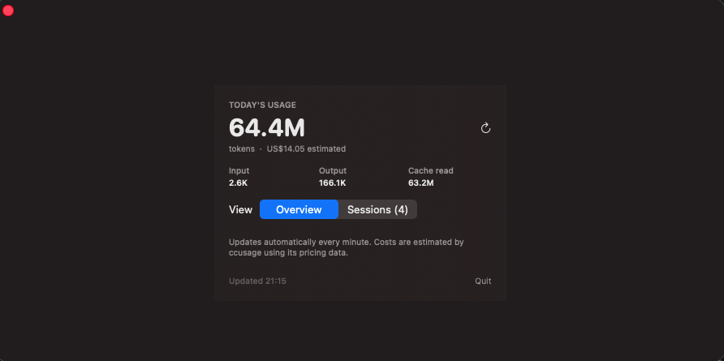

# Claude Code Usage Widget for macOS

A native macOS desktop widget for monitoring today's [Claude Code](https://docs.anthropic.com/en/docs/claude-code) usage. It uses [`ccusage`](https://github.com/ryoppippi/ccusage) locally and never sends usage data anywhere.



The medium widget shows today's tokens, estimated cost, session count, and two sessions at a time. Use the arrow controls to page through the remaining sessions. Clicking a session opens Terminal and resumes that exact Claude Code conversation in its original working directory.

The bundled companion app provides the complete overview and refreshes the desktop widget every minute.



## Features

- Claude Code-only daily token and estimated cost totals
- Small and medium native WidgetKit layouts
- Interactive session pagination in the medium widget
- Session titles, working directories, timestamps, tokens, and cost
- One-click `claude --resume` deep links
- Automatic refresh every 60 seconds
- Local-only data processing

## Requirements

- macOS 14 or later
- Apple Silicon Mac
- Xcode with an Apple ID or Personal Team configured
- [`claude`](https://docs.anthropic.com/en/docs/claude-code) available at `/opt/homebrew/bin/claude`
- [`ccusage`](https://github.com/ryoppippi/ccusage) available in your login shell

Confirm the command-line dependencies:

```sh
command -v claude
command -v ccusage
```

## Install

Clone the repository and run the signed Xcode build:

```sh
git clone <repository-url>
cd ccusage-widget
./build-xcode.sh
```

The script detects the first Personal Team configured in Xcode, builds and signs both targets, installs the app under `~/Applications`, and launches it. You can override team detection when needed:

```sh
DEVELOPMENT_TEAM=YOUR_TEAM_ID ./build-xcode.sh
```

If Xcode is newly installed, finish its initial setup first:

```sh
sudo xcode-select --switch /Applications/Xcode.app/Contents/Developer
sudo xcodebuild -license accept
sudo xcodebuild -runFirstLaunch
```

## Add the desktop widget

1. Right-click an empty area of the desktop.
2. Select **Edit Widgets…**.
3. Search for **Claude Code Usage**.
4. Choose the small or medium size.
5. Click the widget or drag it onto the desktop.

Keep the companion app running so it can refresh usage. To start it automatically, add `~/Applications/ccusage Widget.app` under **System Settings → General → Login Items**.

## How it works

The companion app runs `ccusage claude daily` and `ccusage claude session`, enriches sessions from Claude's local history, and writes a small snapshot under `~/Library/Application Support/ccusage-widget`. The sandboxed WidgetKit extension receives read-only access to that snapshot.

Session clicks use the private `ccusage-widget://` URL scheme. The companion app converts the deep link into a local Terminal command:

```sh
claude --resume <session-id>
```

## Development

Open [CCUsageWidget.xcodeproj](CCUsageWidget.xcodeproj) in Xcode, or rebuild from Terminal:

```sh
./build-xcode.sh
```

The project contains two targets:

- `CCUsageWidgetApp`: data collection, full session view, and resume handling
- `ClaudeUsageWidget`: small and medium WidgetKit views

Build products and local Xcode state are intentionally excluded from Git.
